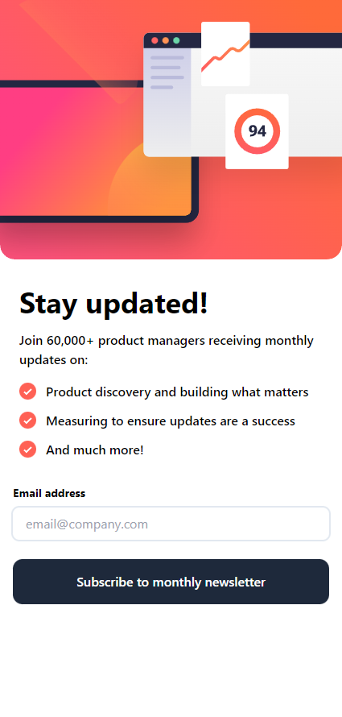
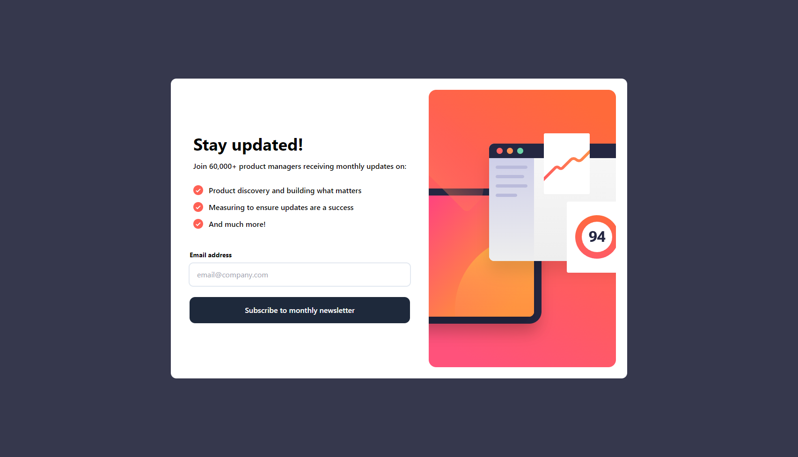
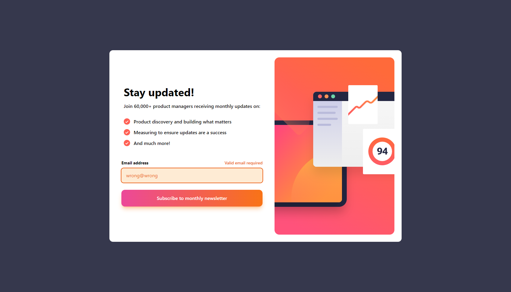
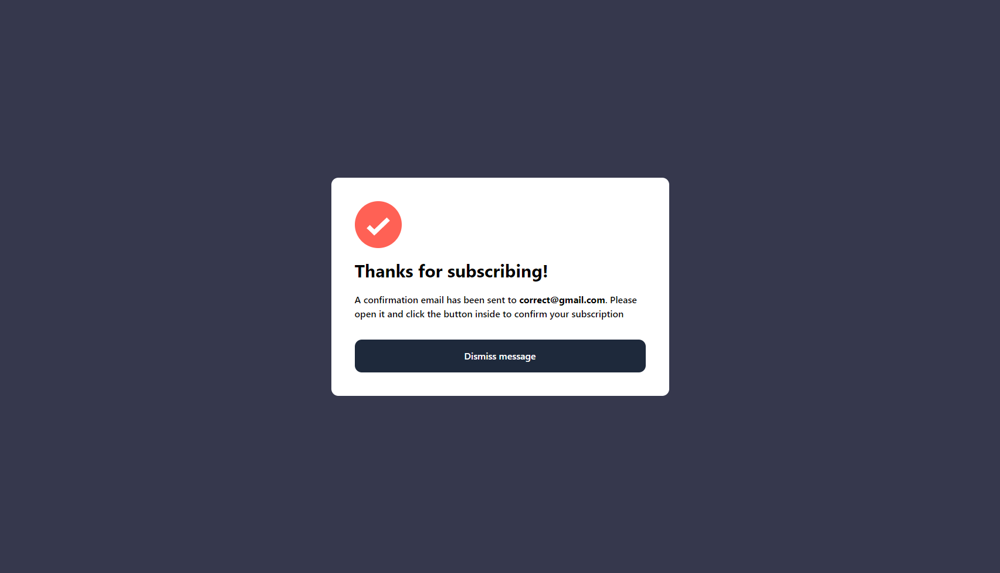

  

<h1 align="center">Newsletter Sign Up with Success Message centeromponent</h1>

## Table of contents

- [Table of contents](#table-of-contents)
- [About](#about)
- [Screenshots](#screenshots)
- [Built with](#built-with)
- [Links](#links)
- [License](#license)

## About

This repository contains a simple component of a sign up page with validation and a success message. Made as a solution to one of the Frontend Mentor challenges. Made with React, TailwindCSS and Vite. Fully functional, fully responsive.

## Screenshots

## Built with

## Links

- [Live Preview](https://seesmof.github.io/newsletter-sign-up-with-success-message-component/)

## License

This project is licensed under the [MIT License](./LICENSE).

<a href="#readme-top"><strong>Back to top</strong></a>

